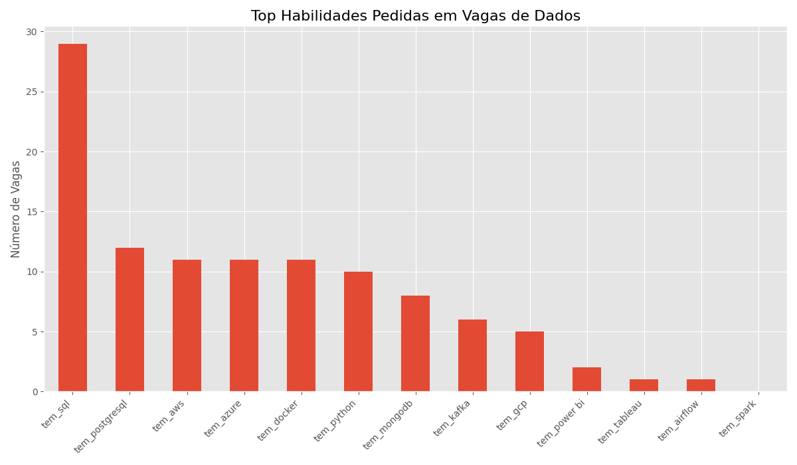

# 📊 Pipeline de Análise de Vagas para Engenharia de Dados


## 🎯 Objetivo

Este projeto implementa um pipeline de dados **ETL (Extract, Transform, Load)** completo, projetado para automatizar a coleta, limpeza e análise de vagas de emprego na área de Engenharia de Dados. O objetivo é transformar dados não estruturados da web em insights acionáveis sobre as tecnologias e habilidades mais demandadas pelo mercado atualmente.

## ✨ Resultado Final

O pipeline processa os dados coletados e gera uma visualização das habilidades técnicas mais mencionadas nas descrições das vagas, oferecendo um panorama claro das tendências do setor.



## 🏛️ Arquitetura do Pipeline

O projeto segue a clássica arquitetura ETL, dividida em quatro etapas principais:

1.  **`Extração (Extract)`**
    * Um script de web scraping (`01_extracao.py`) navega pelo portal de empregos **Programathor** para coletar informações brutas das vagas, como título, empresa, local e a descrição completa.
    * **Ferramentas:** `Requests`, `BeautifulSoup4`.

2.  **`Transformação (Transform)`**
    * O script `02_transformacao.py` recebe os dados brutos e realiza uma limpeza profunda, padronizando o texto e corrigindo inconsistências.
    * Nesta fase, os dados são enriquecidos: uma análise da descrição de cada vaga identifica a presença de *skills* técnicas chave (ex: Python, AWS, SQL, Spark), criando novas colunas para análise quantitativa.
    * **Ferramentas:** `Pandas`, `re` (Expressões Regulares).

3.  **`Carga (Load)`**
    * Os dados limpos e enriquecidos são carregados pelo script `03_carga.py` para um banco de dados relacional.
    * **Ferramentas:** `SQLite`.

4.  **`Análise e Visualização (Analyze & Visualize)`**
    * Um notebook (`analise.ipynb`) conecta-se ao banco de dados para realizar consultas e agregar os dados, contando a frequência de cada habilidade.
    * O resultado da análise é exibido em um gráfico de barras, facilitando a interpretação dos resultados.
    * **Ferramentas:** `Jupyter Lab`, `Matplotlib`, `Pandas`.

## 🛠️ Tecnologias Utilizadas

* **Linguagem de Programação:** Python
* **Bibliotecas de Dados:** Pandas, Matplotlib
* **Web Scraping:** Requests, BeautifulSoup4
* **Banco de Dados:** SQLite
* **Ambiente e Análise:** venv, Jupyter Lab
* **Controle de Versão:** Git & GitHub

## 🚀 Como Executar o Projeto

Siga os passos abaixo para executar o pipeline em seu ambiente local.

**Pré-requisitos:**
* Python 3.9+
* Git

**Passos:**

1.  **Clone o repositório:**
    ```bash
    git clone [https://github.com/joaosousa021/pipeline-analise-vagas.git](https://github.com/joaosousa021/pipeline-analise-vagas.git)
    cd pipeline-analise-vagas
    ```

2.  **Crie e ative o ambiente virtual:**
    ```bash
    python -m venv venv
    # No Windows:
    .\venv\Scripts\activate
    # No Mac/Linux:
    source venv/bin/activate
    ```

3.  **Instale as dependências a partir do arquivo `requirements.txt`:**
    ```bash
    pip install -r requirements.txt
    ```

4.  **Execute o pipeline ETL completo:**
    ```bash
    python 01_extracao.py
    python 02_transformacao.py
    python 03_carga.py
    ```
    *Ao final, os arquivos `vagas_brutas.csv`, `vagas_processadas.csv` e `vagas.db` serão gerados.*

5.  **Visualize a análise:**
    * Inicie o Jupyter Lab:
        ```bash
        python -m jupyter lab
        ```
    * No seu navegador, abra o arquivo `analise.ipynb`.
    * Para executar cada passo da análise, selecione uma célula e pressione **`Shift + Enter`**. A última célula irá gerar o gráfico `top_skills.png`.
